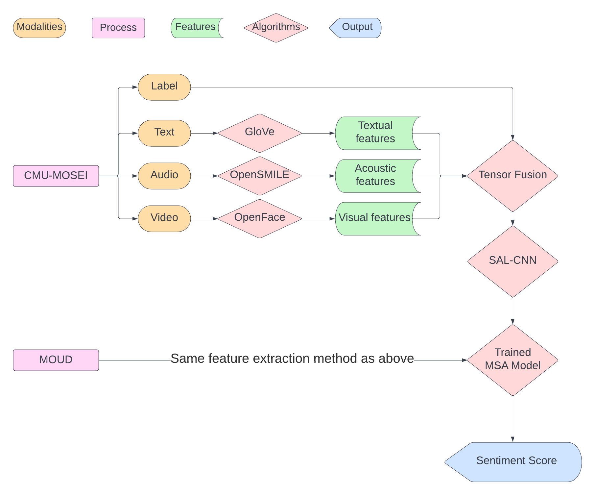

# TeFSAL-Model

## Abstract
Sentiment analysis, a domain within natural language processing (NLP), focuses on interpreting emotions, attitudes, and sentiments primarily from written text. However, recent research has extended this analysis to include audio and visual data, creating a burgeoning field known as Multimodal Sentiment Analysis (MSA). MSA is an evolving discipline dedicated to comprehending emotional expressions in not only text but also acoustic and visual inputs. Many MSA models have been built in recent years with different frameworks \cite{lai2023multimodal}, from statistical non-machine learning techniques, to complex neural networks. However, not many focus on generalization performance, which is the ability to predict unprecedented data. This project focuses on using pre-trained state-of-the-art Convolutional Neural Network (CNN) together with Tensor Fusion Network (TFN) and Select-Additive Learning algorithm (SAL) to improve the
model's ability to accurately predict unencountered data. 

## Project Details
### Software Architecture Diagram

### Software Demonstration Video
Click the link to watch: [https://youtu.be/jBZY8uPZPzQ?si=4WCkPPp2gRGuePCd](https://youtu.be/Dn-6aoVNxg8)

